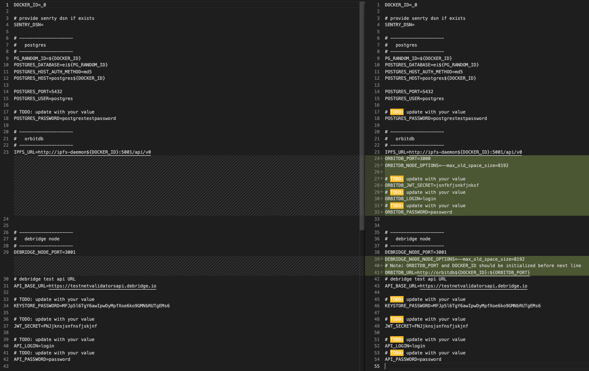
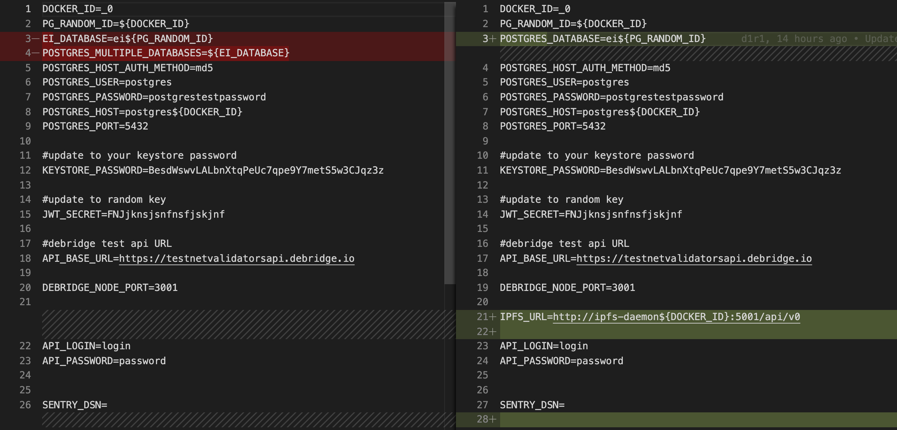

<br/>
<p align="center">
<a href="https://debridge.finance/" target="_blank">

</a>
</p>
<br/>

[deBridge](https://debridge.finance/) — cross-chain interoperability
 and liquidity transfer protocol that allows the truly decentralized transfer of data and assets between various blockchains. deBridge protocol is an infrastructure platform and a hooking service which aims to become a standard for:
- cross-chain composability of smart contracts
- cross-chain swaps
- bridging of any arbitrary asset
- interoperability and bridging of NFTs

More information about the project can be also found in the [documentation portal](https://docs.debridge.finance/)

deBridge node is a software that is run by deBridge validators who were elected by the protocol governance and perform validation of all cross-chain transactions passed through the protocol. All active validators are listening for events emitted by transactions that pass through deBridge smart contract and once an event achieves its finality validator signs the unique id of the event by private key and stores signature to Orbitdb -  public IPFS database. In order to have transaction executed in the target chain user or arbitrary keeper needs to collect minimal required signatures of deBridge validators from IPFS and pass them alongside all transaction parameters to the deBridge smart contract in the target chain. The smart contract will validate all signatures and execute message/data passed in the transaction

In order to set up the validation node, the following steps should be performed:

## Install prerequisite packages on your server:

  1. docker
    - https://docs.docker.com/engine/install/ubuntu/
  2. docker-compose
    - https://docs.docker.com/compose/install/
  3. nodejs
    - https://github.com/nodesource/distributions/blob/master/README.md
  5. psql
    ``` sudo apt-get install postgresql-client```

## Set up the blockchain infrastructure:
1. Install full testnet nodes
  - [Kovan](https://kovan-testnet.github.io/website/)
  - [BSC](https://docs.binance.org/smart-chain/developer/fullnode.html)
  - [HECO](https://docs.hecochain.com/#/en-us/dev/deploy)
  - Arbitrum
  - [Polygon](https://docs.polygon.technology/docs/validate/technical-requirements/)

2. Update configs
   1. Make a copy of the default config:
    ```shell
    cp ./config/chains_config_default.json ./config/chains_config.json
    ```
   2. Update HTTP RPC URL in /config/chains_config.json

3. Copy `.default.env` file and rename it to `.env`. Change default POSTGRES_PASSWORD, POSTGRES_USER credentials in .env file. During the first run (point 9) Postgres database will be automatically created with these credentials.
deBridge node has an embedded API through which node operator can authorize, query last scanned blocks, or rescan blockchain from the specific block. By default deBridge node is deployed on DEBRIDGE_NODE_PORT from .env file. Update JWT_SECRET, API_LOGIN, API_PASSWORD, ORBITDB_JWT_SECRET, ORBITDB_LOGIN, ORBITDB_PASSWORD to randomly generated ones. If you use sentry to track any errors of the node, please update SENTRY_DSN at .env file.

4. Create a keystore file for the validation node. Script from `generate-keystore` folder can be used. To start generating new keystore info:
  - npm i
  - node index.js

The script will show the newly generated Ethereum address, private key, password for keystore, and keystore info. Copy password to `.env KEYSTORE_PASSWORD`, keystore info to /`secrets/keystore.json`

5. Put the keystore file under `secrets/keystore.json`.
6. Store the password that decrypts the key from `keystore` in the .env file KEYSTORE_PASSWORD.
7. Contact deBridge team  to make your wallet address to be whitelisted by deBridge governance
8. Run the command `docker-compose up --build -d`.
9. Backup and do not delete any files from the following directories:
    - `./data/orbitdb`
    - `./data/ipfs`
10. If there is a need to start multiple instances of the node (e.g. one for testnet and one for mainnet) on one server you can:
  - checkout or copy repo to the new directory
  - change DOCKER_ID variable in .env
  - start as described above

## Update debridge node to the latest version
```shell
# Get latest changes from git
git pull

# Run debridge node
docker-compose up -d
```

# Pinners list
  - `/ip4/139.59.164.64/tcp/4001/p2p/12D3KooWA84FLvoJb2QPut134ej9s4hukwmwpZ5DQXbebNBfogdk`
  - `/ip4/161.35.31.27/tcp/4001/p2p/12D3KooWAfR9K7y4Y63dbCJ3io58dgTtFM3F2nycFWLo1LJg3Z1k`
  - `/ip4/164.90.237.61/tcp/4001/p2p/12D3KooWDZxx4TMUjQzqqQAdZKUWNWAamcoBkMWBKfNnfLMSM6mP`
  - `/dnsaddr/londonswarm.debridge.io/p2p/12D3KooWA84FLvoJb2QPut134ej9s4hukwmwpZ5DQXbebNBfogdk`
  
To add node to the bootstrap list manually, you can use the command:
```shell
docker-compose exec ipfs-daemon ipfs bootstrap add "$PINNER_ADDRESS"
```

# Miscellaneous

Connect to the database(if you use docker-compose):

```
docker exec -it $(docker-compose ps | grep postgres | awk '{print $1}') psql -v ON_ERROR_STOP=1 --username postgres -d $DATABASE_NAME
```

# Mandatory monitorings

1. Basic monitoring of the server/virtual machine(CPU, memory, disk space).
2. Availability check:
  - each of the full nodes(heco, bsc, etc). It is also good to check the synchronization status
  - database
  - deBridge node
3. It's recommended to check `docker-compose logs` for ERROR

# Changelog
## v1.1.2 (10.12.2021)
* add checker for chains_config
* fix config volume mounting
* send debridge-node version to the debridge
* create public ipfs-daemon image

**Full Changelog**: https://github.com/debridge-finance/debridge-launcher/compare/v1.1.1...v1.1.2

## How to update to v1.1.2
### 1. Pull latest changes
```shell
git checkout master
git pull
```
### 2. Run
```shell
docker-compose up -d
```

## v1.1.1 (27.11.2021)
- A component responsible for storing data in IPFS was moved to a separate service - orbitdb
- Fix LogConfirmNewAssets sending to orbitdb
- Add new env vars for orbitdb service and update .default.env to use specific sections for each service

### How to update to v1.1.1
#### 1. Fetch and checkout to the right tag
```shell
git fetch && git checkout v1.1.1
```
#### 2. Since the new orbitdb service was created, you should add following envs to your .env file:
```shell
 - ORBITDB_JWT_SECRET # JWT random string. We recommend using upper and lower case symbols, numbers. The length should be at least 30 characters.
 - ORBITDB_LOGIN # create a login to orbitdb API authentication
 - ORBITDB_PASSWORD # create a strong password to orbitdb API authentication
 - ORBITDB_PORT=3000
 - ORBITDB_NODE_OPTIONS=--max_old_space_size=8192
 - DEBRIDGE_NODE_NODE_OPTIONS=--max_old_space_size=8192
 - ORBITDB_URL=http://orbitdb${DOCKER_ID}:${ORBITDB_PORT} # ORBITDB_PORT and DOCKER_ID should be set before ORBITDB_URL
 ```

**Note: you can find the full list of env vars that you should need to setting up at the .default.env file. The simplest way to check if your .env file is up to date is to backup current .env file, recreate it from .default.env and update it with your values from your original .env.backup file**:
```shell
cp .env .env.backup
cp .default.env .env
vi .env
```

#### 3. Run
```shell
docker-compose up -d
```

## v1.1.0 (25.11.2021)
- Move orbitdb to a separate service
- Add checker for chains_config RPC correctness
- Add monitorings (mounts to the stats directory at host)
- Add node options env for debridge-node and orbitdb services to the .env
- Disable postgres logging for debridge-node

### How to update to v1.1.0
```shell
# pull the latest version
git pull
git checkout v1.1.0

# update .env file:
# 1. add env var `ORBITDB_NODE_OPTION=--max_old_space_size=8192`
# 2. add env var `DEBRIDGE_NODE_NODE_OPTION=--max_old_space_size=8192`
# you can find the full list of env vars at `.default.env` 

# if `./config/chains_config.json` doesn't exist create it from `./config/chains_config_default.json`
cp ./config/chains_config_default.json ./config/chains_config.json
#  and update ./config/chains_config.json with your values

# run new version
docker-compose up —build -d
```

## v1.0.2 (20.11.2021)
 - debridge-node: add timeout for http requests
 - ipfs-daemon: config node with entrypoint.sh script
 - docker-compose.yml: update env vars for debridge-node service
 - .env: update vars for postgres and add variable `IPFS_URL`
### How to update to v1.0.2
```shell
# pull the latest version
git pull

# update .env file as on the screenshot:
# 1. remove  `EI_DATABASE`
# 2. change `POSTGRES_MULTIPLE_DATABASES=${EI_DATABASE}` to `POSTGRES_DATABASE=ei${PG_RANDOM_ID}` 
# 3. add env var `IPFS_URL=http://ipfs-daemon${DOCKER_ID}:5001/api/v0`


# create ./config/chains_config.json from ./config/chains_config_default.json
cp ./config/chains_config_default.json ./config/chains_config.json
# update ./config/chains_config.json with your values

# run new version
docker-compose up —build -d
```


## v1.0.0 (27.10.2021)
 - Change javascript instance of IPFS to separate service, which runs [go-IPFS](https://github.com/ipfs/go-ipfs) daemon.
 - Move orbitdb mounting directory on the host to the top level at `./data/orbitdb`.
 - Added ARBITRUM testnet to [config/chains_config.json](https://github.com/debridge-finance/debridge-launcher/tree/master/config)
 - Added Sentry. If you are using sentry, please update SENTRY_DSN at .env file.
 - Removed DEBRIDGE_API_ACCESS_KEY. We support validators auth by signing message with private key
