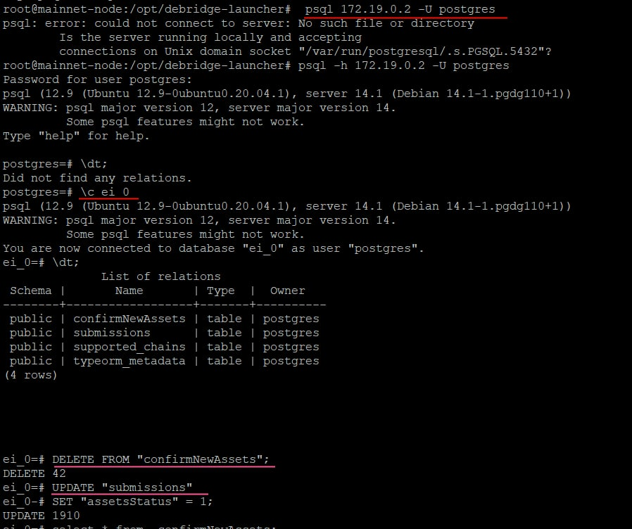
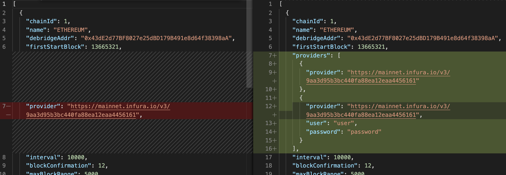

<br/>
<p align="center">
<a href="https://debridge.finance/" target="_blank">

</a>
</p>
<br/>

# Changelog
## v2.6.0(22.06.2023)

* Solana Reader Update: Transitioned from TypeScript Solana Reader API to Rust Solana Reader for more optimized and efficient operations. This service connects to websocket and makes periodic requests for all transactions associated with certain accounts debridge solana program (this process is called resync). It saves the received events to the database. It saves all events, validations occur at the level of sending events to the grpc service.

* Solana Reader Communication: Implemented gRPC service for communication with Debridge node. This service connect to database, validate & present events in public API.

## How to update to v2.6.0
### Pull latest changes
```shell
git checkout mainnet
git pull origin mainnet
```

### Update env
Add new variables
```
POSTGRES_SOLANA_READER_DATABASE=solana${PG_RANDOM_ID}
DEBRIDGE_PROGRAM_PUBKEY=DEbrdGj3HsRsAzx6uH4MKyREKxVAfBydijLUF3ygsFfh
DEBRIDGE_SETTINGS_PROGRAM_PUBKEY=DeSetTwWhjZq6Pz9Kfdo1KoS5NqtsM6G8ERbX4SSCSft

RUST_LOG=info,tokio_util=warn,hyper=warn

# TODO: update with your RPC HTTP
DEBRIDGE_EVENTS_SOLANA_CLUSTER=
# TODO: update with your RPC WSS
DEBRIDGE_EVENTS_SOLANA_WEBSOCKET_CLUSTER=
# Count of transaction processing in one task
#
# Strongly affects the number of requests to RPC in same time
# The larger the number, the fewer parallel requests, 
# the more - the more asynchronous tasks with parallel processing
DEBRIDGE_EVENTS_RESYNC_SIGNATURES_CHUNK_SIZE=5
# In case of Solana RPC errors, there is an additional check that no events
# have been missed. This timeout determines how often service do this check.
#
#Param is optional
DEBRIDGE_EVENTS_CONSISTENCY_CHECK_TIMEOUT_SECS=10
# Time to requery data from the database for stream subscribers
# Can be left at default (1 second).
# If the number of subscribers is large, it should be reduced to control the load on the database
#
#Param is optional
DEBRIDGE_EVENTS_DB_REQUERY_TIMEOUT_IN_SEC=5
# Time to hearbeat
# Can be left at default (5 second).
# How often will this service send the current status of the service, even in the absence of events
DEBRIDGE_EVENTS_HEARTBEAT_TIMEOUT_IN_SEC=30

SOLANA_GRPC_SERVICE_URL=solana-grpc-service${DOCKER_ID}:7777
DEBRIDGE_SOLANA_EVENTS_PSQL=postgres://${POSTGRES_USER}:${POSTGRES_PASSWORD}@${POSTGRES_HOST}:${POSTGRES_PORT}/${POSTGRES_SOLANA_READER_DATABASE}
```

Delete old variables
```
SOLANA_DATA_READER_PORT
SOLANA_RPC
DEBRIDGE_PK
SETTINGS_PK
SOLANA_DATA_READER_API_BASE_URL
SOLANA_DATA_READER_API_SENTRY_DSN
SOLANA_GET_HISTORICAL_BATCH_SIZE
SOLANA_GET_EVENTS_BATCH_SIZE
SOLANA_API_REQUEST_TIMEOUT
SOLANA_API_WAIT_BATCH_INTERVAL
```

### Create new database "solana_0" (solana${PG_RANDOM_ID}) for solana-events-reader
1. First, you need to get into the Docker container's shell. You can do that with the following command:
bash
```
docker exec -it <container-id-or-name> bash
```
Replace <container-id-or-name> with your container's ID or name.

2. Once you're inside the container, you can connect to the PostgreSQL server using the psql command-line interface:
bash
```
psql -U <username> -d <database>
```
Replace <username> with the PostgreSQL username (e.g., postgres), and <database> with the name of an existing database (e.g., postgres).

3. Now that you're connected to the PostgreSQL server, you can execute your CREATE DATABASE command:
sql
```
CREATE DATABASE solana_0;
```

## v2.5.7(25.04.2023)
* upload signatures to bundlr 
* up packages

## How to update to v2.5.7
### Pull latest changes
```shell
git checkout mainnet
git pull origin mainnet
```

### Generate bundlr wallet
```
cd generate-arweave-wallet
npm i
node index.js
```
Copy private key to secrets/bundlr_wallet.json

### Add to env
```
BUNDLR_NODE=http://node2.bundlr.network
```

### remove from env

## v2.4.5(12.12.2022)
* add support running without deBridge api (set empty API_BASE_URL on env)
* change Solana sync algorithm (save intermediate progress, wait SOLANA_API_WAIT_BATCH_INTERVAL between batch requests)
* update Solana reader
* up packages
## How to update to v2.4.5
### Pull latest changes
```shell
git checkout mainnet
git pull origin mainnet
```

### Add to env
```
SOLANA_API_WAIT_BATCH_INTERVAL=1000
```

## v2.3.3(05.08.2022)
* fix check new assets for solana
* up solana reader version

## How to update to v2.3.3
### Pull latest changes
```shell
git checkout mainnet
git pull origin mainnet
```

## v2.3.2(12.07.2022)
* add solana support
* refactoring
* update packages
* add http request/response logging for external service
* add checking .env

## How to update to v2.3.2
### 1. Pull latest changes
```shell
git checkout mainnet
git pull origin mainnet
```

### 2. Add to env
```
SOLANA_DATA_READER_PORT=3007
SOLANA_RPC=
DEBRIDGE_PK=
SETTINGS_PK=

SOLANA_DATA_READER_API_BASE_URL=http://debridge-solanadatareader${DOCKER_ID}:${SOLANA_DATA_READER_PORT}
SOLANA_DATA_READER_API_SENTRY_DSN=
SOLANA_GET_HISTORICAL_BATCH_SIZE=200
SOLANA_GET_EVENTS_BATCH_SIZE=200
SOLANA_API_REQUEST_TIMEOUT=30000
```

### 3. Add to array in config/chains_config.json
```
{
"chainId": 7565164,
"name": "SOLANA",
"debridgeAddr": "",
"firstStartBlock": 0,
"provider": "",
"interval": 10000,
"blockConfirmation": 0,
"maxBlockRange": 0
}
```
Not used next properties: provider, blockConfirmation, maxBlockRange, debridgeAddr. Keep it in json to consistency data.

### 4. Run debridge-node
```shell
docker-compose up -d 
```

## v2.2.2(21.03.2022)
* fix memory leak issue
* don't exit if there are no valid rpc's for the chain
* add unit tests

## How to update to v2.2.2
### Pull latest changes
```shell
git checkout mainnet
git pull origin mainnet
```

### Run debridge-node
```shell
docker-compose up -d --build --remove-orphans
```

<br/>

## v2.2.1(16.03.2022)
* fix nonce validation for historical data

## How to update to v2.2.1

### Pull latest changes
```shell
git checkout mainnet
git pull origin mainnet
```

### Run debridge-node
```shell
docker-compose up -d --build --remove-orphans
```

<br/>

## v2.2.0(14.03.2022)
* changed deployId calculation formula 

## How to update to v2.2.0
```shell
git checkout mainnet
git pull origin mainnet
```
### 2. Run debridge-node
```shell
docker-compose up -d --build --remove-orphans
```
### 3. Regenerate signatures for deployed tokens in the postgres.
```shell
# get postgres container IPAddress
docker inspect postgres_0 | grep "IPAddress"

# run psql with given IPAddress, 
psql -h IPAddress -U postgres 

# connect to the ei_0 database
\c ei_0
```

Execute sql scripts:
```sql
DELETE FROM "confirmNewAssets";

UPDATE "submissions" SET "assetsStatus" = 1;
```


<br/>

## v2.1.1(13.03.2022)
* fix support for multinode rpc connection
* fix nonce validation

## How to update to v2.1.1
```shell
git checkout mainnet
git pull origin mainnet
```
### 2. Run debridge-node
```shell
docker-compose up -d --build --remove-orphans
```

<br/>

## v2.1.0(09.03.2022)
* Added support for multinode rpc connection
* Validate nonce before saving event to the database
* Refactor debrige-node Dockerfile and docker-compose
* Fix leaking connections to the rpc provider
* Add basic auth for node rpc

## How to update to v2.1.0
```shell
git checkout mainnet
git pull origin mainnet
```
### 2. Update .env file with new env var:
```
THROTTLER_TTL=60
THROTTLER_LIMIT=10
WEB3_TIMEOUT=30000

ENABLE_DATAFIX=true
```


### 3. Optional. If you need to use multiple rpc providers or setting up basic auth just update config/chains_config.json as follow::

### 4. Run debridge-node
```shell
docker-compose up -d --build --remove-orphans
```

<br/>

## v1.1.4 (24.12.2021)
* temporary removed ipfs and orbitdb service
* applied halborn security audit

**Full Changelog**: https://github.com/debridge-finance/debridge-launcher/compare/v1.1.3...v1.1.4

## How to update to v1.1.4
### 1. Pull latest changes
```shell
git checkout master

git pull
```
### 2. Add env vars to .env file:
```
THROTTLER_TTL=60
THROTTLER_LIMIT=10
```
### 3. Run
```shell
docker-compose up -d --remove-orphans
```

<br/>

## v1.1.3 (20.12.2021)
* add timeout for Web3 requests

**Full Changelog**: https://github.com/debridge-finance/debridge-launcher/compare/v1.1.2...v1.1.3

## How to update to v1.1.3
### 1. Pull latest changes
```shell
git checkout master
git pull
```
### 2. Run
```shell
docker-compose up -d
```
<br/>

## v1.1.2 (10.12.2021)
* add checker for chains_config
* fix config volume mounting
* send debridge-node version to the debridge
* create public ipfs-daemon image

**Full Changelog**: https://github.com/debridge-finance/debridge-launcher/compare/v1.1.1...v1.1.2

## How to update to v1.1.2
### 1. Pull latest changes
```shell
git checkout master
git pull
```
### 2. Run
```shell
docker-compose up -d
```

<br/>

## v1.1.1 (27.11.2021)
- A component responsible for storing data in IPFS was moved to a separate service - orbitdb
- Fix LogConfirmNewAssets sending to orbitdb
- Add new env vars for orbitdb service and update .default.env to use specific sections for each service

### How to update to v1.1.1
#### 1. Fetch and checkout to the right tag
```shell
git fetch && git checkout v1.1.1
```
#### 2. Since the new orbitdb service was created, you should add following envs to your .env file:
```shell
 - ORBITDB_JWT_SECRET # JWT random string. We recommend using upper and lower case symbols, numbers. The length should be at least 30 characters.
 - ORBITDB_LOGIN # create a login to orbitdb API authentication
 - ORBITDB_PASSWORD # create a strong password to orbitdb API authentication
 - ORBITDB_PORT=3000
 - ORBITDB_NODE_OPTIONS=--max_old_space_size=8192
 - DEBRIDGE_NODE_NODE_OPTIONS=--max_old_space_size=8192
 - ORBITDB_URL=http://orbitdb${DOCKER_ID}:${ORBITDB_PORT} # ORBITDB_PORT and DOCKER_ID should be set before ORBITDB_URL
 ```

**Note: you can find the full list of env vars that you should need to setting up at the .default.env file. The simplest way to check if your .env file is up to date is to backup current .env file, recreate it from .default.env and update it with your values from your original .env.backup file**:
```shell
cp .env .env.backup
cp .default.env .env
vi .env
```

#### 3. Run
```shell
docker-compose up -d
```

<br/>

## v1.1.0 (25.11.2021)
- Move orbitdb to a separate service
- Add checker for chains_config RPC correctness
- Add monitorings (mounts to the stats directory at host)
- Add node options env for debridge-node and orbitdb services to the .env
- Disable postgres logging for debridge-node

### How to update to v1.1.0
```shell
# pull the latest version
git pull
git checkout v1.1.0

# update .env file:
# 1. add env var `ORBITDB_NODE_OPTION=--max_old_space_size=8192`
# 2. add env var `DEBRIDGE_NODE_NODE_OPTION=--max_old_space_size=8192`
# you can find the full list of env vars at `.default.env` 

# if `./config/chains_config.json` doesn't exist create it from `./config/chains_config_default.json`
cp ./config/chains_config_default.json ./config/chains_config.json
#  and update ./config/chains_config.json with your values

# run new version
docker-compose up —build -d
```

<br/>

## v1.0.2 (20.11.2021)
 - debridge-node: add timeout for http requests
 - ipfs-daemon: config node with entrypoint.sh script
 - docker-compose.yml: update env vars for debridge-node service
 - .env: update vars for postgres and add variable `IPFS_URL`
### How to update to v1.0.2
```shell
# pull the latest version
git pull

# update .env file as on the screenshot:
# 1. remove  `EI_DATABASE`
# 2. change `POSTGRES_MULTIPLE_DATABASES=${EI_DATABASE}` to `POSTGRES_DATABASE=ei${PG_RANDOM_ID}` 
# 3. add env var `IPFS_URL=http://ipfs-daemon${DOCKER_ID}:5001/api/v0`


# create ./config/chains_config.json from ./config/chains_config_default.json
cp ./config/chains_config_default.json ./config/chains_config.json
# update ./config/chains_config.json with your values

# run new version
docker-compose up —build -d
```


## v1.0.0 (27.10.2021)
 - Change javascript instance of IPFS to separate service, which runs [go-IPFS](https://github.com/ipfs/go-ipfs) daemon.
 - Move orbitdb mounting directory on the host to the top level at `./data/orbitdb`.
 - Added ARBITRUM testnet to [config/chains_config.json](https://github.com/debridge-finance/debridge-launcher/tree/master/config)
 - Added Sentry. If you are using sentry, please update SENTRY_DSN at .env file.
 - Removed DEBRIDGE_API_ACCESS_KEY. We support validators auth by signing message with private key
