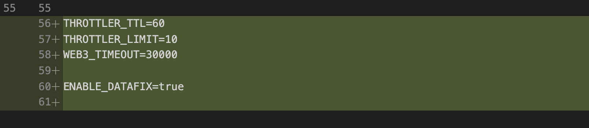
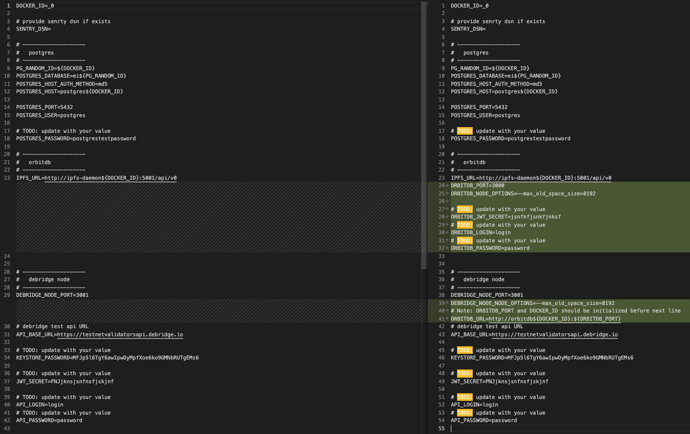

<br/>
<p align="center">
<a href="https://debridge.finance/" target="_blank">

</a>
</p>
<br/>

# Changelog

## v2.2.1(16.03.2022)
* fix nonce validation for historical data

## How to update to v2.2.1

### Pull latest changes
```shell
git checkout mainnet
git pull origin mainnet
```

### Run debridge-node
```shell
docker-compose up -d --build --remove-orphans
```

## v2.2.0(14.03.2022)
* changed deployId calculation formula 

## How to update to v2.2.0
```shell
git checkout mainnet
git pull origin mainnet
```
### 2. Run debridge-node
```shell
docker-compose up -d --build --remove-orphans
```
### 3. Regenerate signatures for deployed tokens in the postgres.
```shell
# get postgres container IPAddress
docker inspect postgres_0 | grep "IPAddress"

# run psql with given IPAddress, 
psql -h IPAddress -U postgres 

# connect to the ei_0 database
\c ei_0
```

Execute sql scripts:
```sql
DELETE FROM "confirmNewAssets";

UPDATE "submissions" SET "assetsStatus" = 1;
```

<br/>

## v2.1.1(13.03.2022)
* fix support for multinode rpc connection
* fix nonce validation

## How to update to v2.1.1
```shell
git checkout mainnet
git pull origin mainnet
```
### 2. Run debridge-node
```shell
docker-compose up -d --build --remove-orphans
```

<br/>

## v2.1.0(09.03.2022)
* Added support for multinode rpc connection
* Validate nonce before saving event to the database
* Refactor debrige-node Dockerfile and docker-compose
* Fix leaking connections to the rpc provider
* Add basic auth for node rpc

## How to update to v2.1.0
```shell
git checkout mainnet
git pull origin mainnet
```
### 2. Update .env file with new env var:
```
THROTTLER_TTL=60
THROTTLER_LIMIT=10
WEB3_TIMEOUT=30000

ENABLE_DATAFIX=true
```



### 3. Optional. If you need to use multiple rpc providers or setting up basic auth just update config/chains_config.json as follow::

### 4. Run debridge-node
```shell
docker-compose up -d --build --remove-orphans
```

<br/>

## v1.1.4 (24.12.2021)
* temporary removed ipfs and orbitdb service
* applied halborn security audit

**Full Changelog**: https://github.com/debridge-finance/debridge-launcher/compare/v1.1.3...v1.1.4

## How to update to v1.1.4
### 1. Pull latest changes
```shell
git checkout master

git pull
```
### 2. Add env vars to .env file:
```
THROTTLER_TTL=60
THROTTLER_LIMIT=10
```
### 3. Run
```shell
docker-compose up -d --remove-orphans
```

<br/>

## v1.1.3 (20.12.2021)
* add timeout for Web3 requests

**Full Changelog**: https://github.com/debridge-finance/debridge-launcher/compare/v1.1.2...v1.1.3

## How to update to v1.1.3
### 1. Pull latest changes
```shell
git checkout master
git pull
```
### 2. Run
```shell
docker-compose up -d
```
<br/>

## v1.1.2 (10.12.2021)
* add checker for chains_config
* fix config volume mounting
* send debridge-node version to the debridge
* create public ipfs-daemon image

**Full Changelog**: https://github.com/debridge-finance/debridge-launcher/compare/v1.1.1...v1.1.2

## How to update to v1.1.2
### 1. Pull latest changes
```shell
git checkout master
git pull
```
### 2. Run
```shell
docker-compose up -d
```

<br/>

## v1.1.1 (27.11.2021)
- A component responsible for storing data in IPFS was moved to a separate service - orbitdb
- Fix LogConfirmNewAssets sending to orbitdb
- Add new env vars for orbitdb service and update .default.env to use specific sections for each service

### How to update to v1.1.1
#### 1. Fetch and checkout to the right tag
```shell
git fetch && git checkout v1.1.1
```
#### 2. Since the new orbitdb service was created, you should add following envs to your .env file:
```shell
 - ORBITDB_JWT_SECRET # JWT random string. We recommend using upper and lower case symbols, numbers. The length should be at least 30 characters.
 - ORBITDB_LOGIN # create a login to orbitdb API authentication
 - ORBITDB_PASSWORD # create a strong password to orbitdb API authentication
 - ORBITDB_PORT=3000
 - ORBITDB_NODE_OPTIONS=--max_old_space_size=8192
 - DEBRIDGE_NODE_NODE_OPTIONS=--max_old_space_size=8192
 - ORBITDB_URL=http://orbitdb${DOCKER_ID}:${ORBITDB_PORT} # ORBITDB_PORT and DOCKER_ID should be set before ORBITDB_URL
 ```

**Note: you can find the full list of env vars that you should need to setting up at the .default.env file. The simplest way to check if your .env file is up to date is to backup current .env file, recreate it from .default.env and update it with your values from your original .env.backup file**:
```shell
cp .env .env.backup
cp .default.env .env
vi .env
```

#### 3. Run
```shell
docker-compose up -d
```

<br/>

## v1.1.0 (25.11.2021)
- Move orbitdb to a separate service
- Add checker for chains_config RPC correctness
- Add monitorings (mounts to the stats directory at host)
- Add node options env for debridge-node and orbitdb services to the .env
- Disable postgres logging for debridge-node

### How to update to v1.1.0
```shell
# pull the latest version
git pull
git checkout v1.1.0

# update .env file:
# 1. add env var `ORBITDB_NODE_OPTION=--max_old_space_size=8192`
# 2. add env var `DEBRIDGE_NODE_NODE_OPTION=--max_old_space_size=8192`
# you can find the full list of env vars at `.default.env` 

# if `./config/chains_config.json` doesn't exist create it from `./config/chains_config_default.json`
cp ./config/chains_config_default.json ./config/chains_config.json
#  and update ./config/chains_config.json with your values

# run new version
docker-compose up —build -d
```

<br/>

## v1.0.2 (20.11.2021)
 - debridge-node: add timeout for http requests
 - ipfs-daemon: config node with entrypoint.sh script
 - docker-compose.yml: update env vars for debridge-node service
 - .env: update vars for postgres and add variable `IPFS_URL`
### How to update to v1.0.2
```shell
# pull the latest version
git pull

# update .env file as on the screenshot:
# 1. remove  `EI_DATABASE`
# 2. change `POSTGRES_MULTIPLE_DATABASES=${EI_DATABASE}` to `POSTGRES_DATABASE=ei${PG_RANDOM_ID}` 
# 3. add env var `IPFS_URL=http://ipfs-daemon${DOCKER_ID}:5001/api/v0`


# create ./config/chains_config.json from ./config/chains_config_default.json
cp ./config/chains_config_default.json ./config/chains_config.json
# update ./config/chains_config.json with your values

# run new version
docker-compose up —build -d
```


## v1.0.0 (27.10.2021)
 - Change javascript instance of IPFS to separate service, which runs [go-IPFS](https://github.com/ipfs/go-ipfs) daemon.
 - Move orbitdb mounting directory on the host to the top level at `./data/orbitdb`.
 - Added ARBITRUM testnet to [config/chains_config.json](https://github.com/debridge-finance/debridge-launcher/tree/master/config)
 - Added Sentry. If you are using sentry, please update SENTRY_DSN at .env file.
 - Removed DEBRIDGE_API_ACCESS_KEY. We support validators auth by signing message with private key